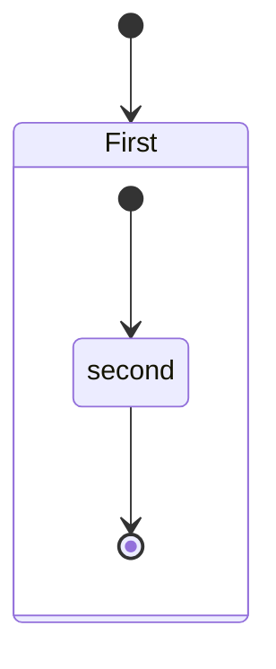
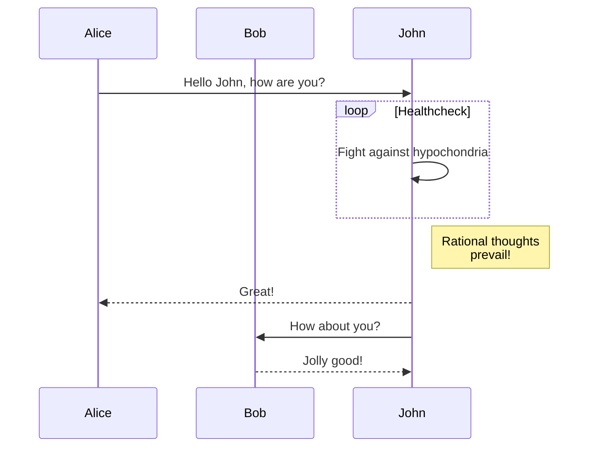

## Github Blog TEST  

 * Github page 만드는 방법  
  https://lab.github.com/githubtraining/github-pages  

## Github Pages 설정방법

 * Pages의 Root 설정  
 
  * **Github->Repository->Setting->Pages** 
  1. Source: Host Web 상위 index file 위치 (index.html or index.md) 
  2. Theme : Jekyll theme 선택 (default)

 * minimal-mistakes-jekyll 의 설정파일  
  * **_config.yml**    
  https://mmistakes.github.io/minimal-mistakes/docs/configuration/   

## Github Pages Examples

* Github Hosting Site Ex.1 and Repository  (Current Git)
  * WEB: https://jeonghunlee.github.io/  
  * GIT: https://github.com/JeonghunLee/JeonghunLee.github.io
  
* Github Hosting Site Ex.2 and Repository  
  * WEB: https://jeonghunlee.github.io/blog/   
  * GIT: https://github.com/JeonghunLee/blog
  
* Github Hosting Site Ex.3 and Repository  
  * WEB: https://jeonghunlee.github.io/minima/  
  * GIT: https://github.com/JeonghunLee/minima/settings/pages
 
## README 에 그림추가   
   

## README 에 링크 추가하여 확장하기    
* [Setup-1](docs/setup-1.md)
* [Setup-2](docs/setup-2.md)
	* [Function Goto TEST1 ](docs/function.md#test1)
	* [Function Goto TEST2 ](docs/function.md#test2)


## 항목   

 1. 테스트 1
 2. 테스트 2
 3. 테스트 3
 	1. 테스트 A Tap 사용 
	2. 테스트 B
	3. 테스트 C
 
 * 테스트 1
 * 테스트 2
 * 테스트 3
   * 테스트 A
   * 테스트 B
   * 테스트 C

## 왼쪽  
> &nbsp;&nbsp;&nbsp;&nbsp; TEST1 <br/>
> &nbsp;&nbsp;&nbsp;&nbsp; TEST2 <br/>
> &nbsp;&nbsp;&nbsp;&nbsp; TEST3 <br/>

## Web 의 HTML 이용 
<br/>
&nbsp;&nbsp;&nbsp;&nbsp; TEST1 <br/>
&nbsp;&nbsp;&nbsp;&nbsp; TEST2 <br/>
&nbsp;&nbsp;&nbsp;&nbsp; TEST3 <br/>
<br/>
<br/>

## Source 및 관련에제 추가 

```
this is source 
```

# Title-1
## 제목 2
### 제목 3-A
### 제목 3-B
#### 제목 4-A
#### 제목 4-B
##### 제목 5-A
##### 제목 5-B
###### 제목 6-A
###### 제목 6-B

## 체크 박스 
- [x] test check box 1 
- [ ] test check box 2
- [ ] test check box 2
- [ ] test check box 2

### 수평선 

<br/>
<br/>

---
***
---

<br/>
<br/>

### Github Manual   
      
[Github Diaram](https://docs.github.com/en/get-started/writing-on-github/working-with-advanced-formatting/creating-diagrams)     
[Github Math Expression](https://docs.github.com/en/get-started/writing-on-github/working-with-advanced-formatting/writing-mathematical-expressions)        


### UML TEST 


아래와 같이 PLAT UML Server 접속하여 관련부분을 연결하여 사용하자.      
http://www.plantuml.com/plantuml/uml/SyfFKj2rKt3CoKnELR1Io4ZDoSa70000


** UML Ex.1**   
```
@startuml
Bob -[#red]> Alice : hello
Alice -[#0000FF]->Bob : ok
@enduml
```


** UML Ex.2**   
```
@startuml
robust "Web Browser" as WB
concise "Web User" as WU

@0
WU is Idle
WB is Idle

@100
WU is Waiting
WB is Processing

@300
WB is Waiting
@enduml
```


### Mermaid TEST

Github에서 Mermaid가 지원되므로 Mermaid를 사용법알아 사용하자            
  https://mermaid-js.github.io/mermaid/#/            

** Mermaid Ex.1**   



** Mermaid Ex.2**   




### Markdown 사용설명
  https://heropy.blog/2017/09/30/markdown/   
  https://gist.github.com/ihoneymon/652be052a0727ad59601   
  https://github.com/JeonghunLee/jetson-inference


  
##
<p align="center"><sup>© 2022 JHLEE | </sup><a href="#Title-1"><sup>Table of Contents</sup></a></p>

