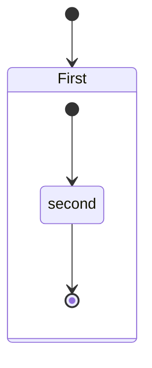
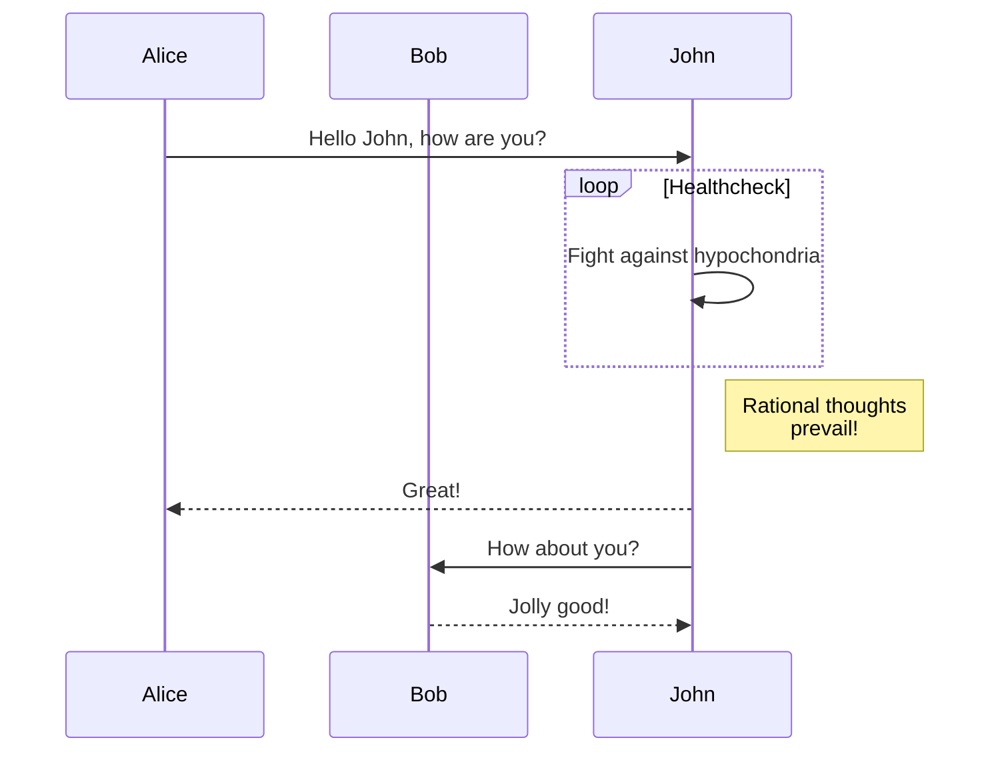

## Github Blog TEST  

<br/>

* Github Main Page    
  [jeonghunlee.github.io](https://jeonghunlee.github.io/)    

<br/>

 * Github page 만드는 방법  
  https://lab.github.com/githubtraining/github-pages  

<br/>

## Github Pages (How To use) 설정방법  

 * Pages의 Root 설정  
 
  * **Github->Repository->Setting->Pages** 
  1. Source: Host Web 상위 index file 위치 (index.html or index.md) 
  2. Theme : Jekyll theme 선택 (default)

 * minimal-mistakes-jekyll 의 설정파일  
  * **_config.yml**    

Refer to               
[How to Use Github Pages](https://mmistakes.github.io/minimal-mistakes/docs/configuration/)                
[How to Use Github Pages](https://docs.github.com/en/pages)                   

## Github Pages Examples   

* Github Hosting Site Ex.1 and Repository  (Current Git)
  * WEB: https://jeonghunlee.github.io/  
  * GIT: https://github.com/JeonghunLee/JeonghunLee.github.io
  
* Github Hosting Site Ex.2 and Repository  
  * WEB: https://jeonghunlee.github.io/blog/   
  * GIT: https://github.com/JeonghunLee/blog
  
* Github Hosting Site Ex.3 and Repository  
  * WEB: https://jeonghunlee.github.io/minima/  
  * GIT: https://github.com/JeonghunLee/minima/settings/pages
 
## README 에 그림추가   
   

## README 에 링크 추가하여 확장하기    
* [Setup-1](docs/setup-1.md)
* [Setup-2](docs/setup-2.md)
	* [Function Goto TEST1 ](docs/function.md#test1)
	* [Function Goto TEST2 ](docs/function.md#test2)


## README 항목   

 1. 테스트 1
 2. 테스트 2
 3. 테스트 3
 	1. 테스트 A Tap 사용 
	2. 테스트 B
	3. 테스트 C
 
 * 테스트 1
 * 테스트 2
 * 테스트 3
   * 테스트 A
   * 테스트 B
   * 테스트 C

## README 왼쪽  
> &nbsp;&nbsp;&nbsp;&nbsp; TEST1 <br/>
> &nbsp;&nbsp;&nbsp;&nbsp; TEST2 <br/>
> &nbsp;&nbsp;&nbsp;&nbsp; TEST3 <br/>

## README 안에 Web 의 HTML 이용 
<br/>
&nbsp;&nbsp;&nbsp;&nbsp; TEST1 <br/>
&nbsp;&nbsp;&nbsp;&nbsp; TEST2 <br/>
&nbsp;&nbsp;&nbsp;&nbsp; TEST3 <br/>
<br/>
<br/>

## README 안에 Source 및 관련에제 추가 

```
this is source 
```


Table of Contents
------------------------------------------------------

# Title-1
## 제목 2
### 제목 3-A
### 제목 3-B
#### 제목 4-A
#### 제목 4-B
##### 제목 5-A
##### 제목 5-B
###### 제목 6-A
###### 제목 6-B

## 체크 박스 
- [x] test check box 1 
- [ ] test check box 2
- [ ] test check box 2
- [ ] test check box 2

### 수평선 

<br/>
<br/>

---
***
---

<br/>
<br/>

### Github Manual Diagrams   

<br/>

기본적으로 읽어야 할 Github Manual들           
Github도 Diagrams의 Mermaid 는 지원을 해주지만, UML은 기본지원을 해주지 않아 아래처럼 다른 곳을 이용하여 사용가능하다.       
만약 Sphinx 사용해본 경험이 있다면, Mermaid 와 UML 이 가장 필요할 것으로 생각되어지지만, 구지 문서를 다 오픈하면, Readthedoc를 이용하면 되니까          
       
<br/>
<br/>

[Github Diaram](https://docs.github.com/en/get-started/writing-on-github/working-with-advanced-formatting/creating-diagrams)     
[Github Math Expression](https://docs.github.com/en/get-started/writing-on-github/working-with-advanced-formatting/writing-mathematical-expressions)        
[My Blog](https://ahyuo79.blogspot.com/search/label/DevOps-ReadTheDoc)             

<br/>

### Mathematical expressions

**The Cauchy-Schwarz Inequality**

$$\left( \sum_{k=1}^n a_k b_k \right)^2 \leq \left( \sum_{k=1}^n a_k^2 \right) \left( \sum_{k=1}^n b_k^2 \right)$$

### 지도기능 

이부분은 최근에 추가되어진 것 같은데, 솔직히 어디에 써야할지 모르겠다. 


```geojson
{
  "type": "FeatureCollection",
  "features": [
    {
      "type": "Feature",
      "id": 1,
      "properties": {
        "ID": 0
      },
      "geometry": {
        "type": "Polygon",
        "coordinates": [
          [
              [-90,35],
              [-90,30],
              [-85,30],
              [-85,35],
              [-90,35]
          ]
        ]
      }
    }
  ]
}
```

상위 Github 예제에서 가져옴 

```topojson
{
  "type": "Topology",
  "transform": {
    "scale": [0.0005000500050005, 0.00010001000100010001],
    "translate": [100, 0]
  },
  "objects": {
    "example": {
      "type": "GeometryCollection",
      "geometries": [
        {
          "type": "Point",
          "properties": {"prop0": "value0"},
          "coordinates": [4000, 5000]
        },
        {
          "type": "LineString",
          "properties": {"prop0": "value0", "prop1": 0},
          "arcs": [0]
        },
        {
          "type": "Polygon",
          "properties": {"prop0": "value0",
            "prop1": {"this": "that"}
          },
          "arcs": [[1]]
        }
      ]
    }
  },
  "arcs": [[[4000, 0], [1999, 9999], [2000, -9999], [2000, 9999]],[[0, 0], [0, 9999], [2000, 0], [0, -9999], [-2000, 0]]]
}
```

### STL 3D models

이 부분도 최근 추가되어진 것 같은데, 나중에 쓸모가 있겠지 

```stl
solid cube_corner
  facet normal 0.0 -1.0 0.0
    outer loop
      vertex 0.0 0.0 0.0
      vertex 1.0 0.0 0.0
      vertex 0.0 0.0 1.0
    endloop
  endfacet
  facet normal 0.0 0.0 -1.0
    outer loop
      vertex 0.0 0.0 0.0
      vertex 0.0 1.0 0.0
      vertex 1.0 0.0 0.0
    endloop
  endfacet
  facet normal -1.0 0.0 0.0
    outer loop
      vertex 0.0 0.0 0.0
      vertex 0.0 0.0 1.0
      vertex 0.0 1.0 0.0
    endloop
  endfacet
  facet normal 0.577 0.577 0.577
    outer loop
      vertex 1.0 0.0 0.0
      vertex 0.0 1.0 0.0
      vertex 0.0 0.0 1.0
    endloop
  endfacet
endsolid
```


### UML TEST 

Github에서는 이를 미지원해주므로 아래 사이트와 연결하자(역시 잔머리)          
아래와 같이 PLAT UML Server 접속하여 관련부분을 연결하여 사용하자.         

UML SITE 
  http://www.plantuml.com/plantuml/uml/SyfFKj2rKt3CoKnELR1Io4ZDoSa70000


** UML Ex.1**   
```
@startuml
Bob -[#red]> Alice : hello
Alice -[#0000FF]->Bob : ok
@enduml
```


** UML Ex.2**   
```
@startuml
robust "Web Browser" as WB
concise "Web User" as WU

@0
WU is Idle
WB is Idle

@100
WU is Waiting
WB is Processing

@300
WB is Waiting
@enduml
```


### Mermaid TEST

Github에서 Mermaid가 지원되므로 Mermaid를 사용법알아 사용하자            
  https://mermaid-js.github.io/mermaid/#/            

** Mermaid Ex.1**   



** Mermaid Ex.2**   




### Markdown 사용설명   

기본적인 Markdown 설명 참조      
  https://heropy.blog/2017/09/30/markdown/   
  https://gist.github.com/ihoneymon/652be052a0727ad59601   
  https://github.com/JeonghunLee/jetson-inference


  
##
<p align="center"><sup>© 2022 JHLEE | </sup><a href="#Title-1"><sup>Table of Contents</sup></a></p>

